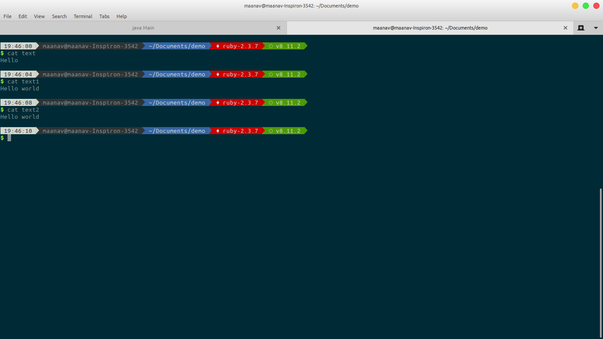
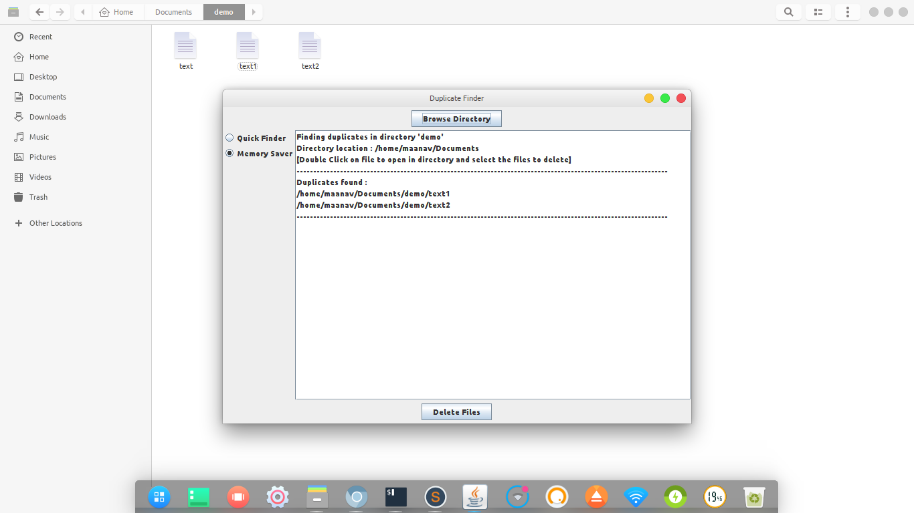
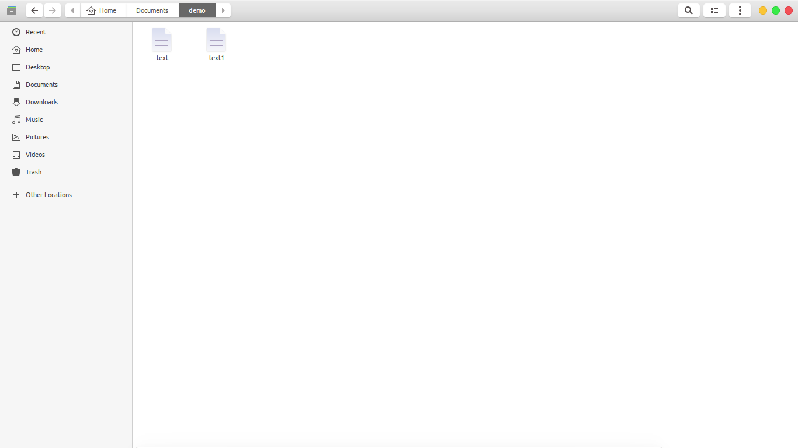

# duplicate-file-finder
A Java application with GUI(Swing) to find all the duplicate files in a given directory and all its sub-directories, using the SHA-512 hash function

### Introduction

This is a simple app to scan through all the files in a given directory, then list out all the duplicate files according to their MD5 hash values. Very quickly find files with duplicate content, and provides the option to delete duplicates.

### Features

- List all duplicates in a directory and sub-directories
- Two modes (Quick finder and Memory Saver)
  * Quick finder: Quickly finds the duplicates using message digest function
  * Memory saver: Finds duplicates by limiting the size of buffer used by the same message digest function
- GUI to select directory and browse through them
- Provides option to delete the file

### Screenshots

|     |  |
| --------------------------------------- | ---------------------------------------- |

|     |  |
| ---------------------------------------- | ---------------------------------------- |

|     |  |
| ---------------------------------------- | ---------------------------------------- |

### Contributing

Bug reports and pull requests are welcome on GitHub at https://github.com/maanavshah/duplicate-file-finder. This project is intended to be a safe, welcoming space for collaboration, and contributors are expected to adhere to the [Contributor Covenant](http://contributor-covenant.org) code of conduct.

### License

The content of this repository is licensed under [MIT LICENSE](LICENSE).
